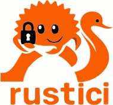

<p align="center">
  
</p>

<p align="center">
  A minimal Rust client for the strongSwan <strong>VICI</strong> protocol — inspired by the ideas behind <code>davici</code>, but implemented from scratch in Rust.
</p>

<p align="center">
  <a href="https://github.com/mira-mobility/rustici/actions/workflows/ci.yml"></a>
  <a href="LICENSE"></a>
  
</p>

<p align="center"><em>Status: experimental MVP. Pure <code>std</code>, blocking I/O, UNIX-only. No external deps.</em></p>

## Features

- Encode/decode VICI **messages** (sections, lists, key/values).
- Encode/decode VICI **packets** and transport framing (32-bit BE length).
- **Blocking** client over `UnixStream` for request/response commands.
- Register/unregister for **events** and read event messages.
- No dependency on `libstrongswan` or `davici` — fresh Rust code.

> Note: This library focuses on the protocol. It intentionally does not try to mirror the exact C API. Instead, it provides a small, idiomatic Rust surface that's easy to extend with higher-level helpers.

## Example

List IKE_SAs using the `list-sas` command:

```rust
use rustici::{Client, Message};

fn main() -> Result<(), Box<dyn std::error::Error>> {
    let mut cli = Client::connect(rustici::client::DEFAULT_SOCKET)?;

    // empty request message
    let req = Message::new();

    let resp = cli.call("list-sas", &req)?;
    println!("{}", resp);
    Ok(())
}
```

Build and run example:

```bash
cargo run --example list_sas
```

## Protocol references

- VICI plugin docs: https://docs.strongswan.org/docs/latest/plugins/vici.html
- VICI protocol README (packet/message grammar; transport is length-prefixed with a 32-bit BE header)

## Acknowledgments

This library is a Rust implementation based on the [davici library](https://github.com/strongswan/davici) from the strongSwan project.

strongSwan has been actively developed since 2005, with the modern IKE daemon written from scratch in a modular, object-oriented design. The intellectual property rights to strongSwan were acquired by secunet Security Networks AG in June 2022.
We thank the strongSwan maintainers and contributors for their excellent work:

Andreas Steffen (strongSec GmbH)
Tobias Brunner (codelabs GmbH)
secunet Security Networks AG
Martin Willi (original davici author)

## License

This library is licensed under the GNU Lesser General Public License v2.1 or later (LGPL-2.1+) (Based on the original davici library).

Rust implementation:

- Copyright (C) 2025 Mira Mobility

See the [LICENSE](LICENSE) file for the full license text.
